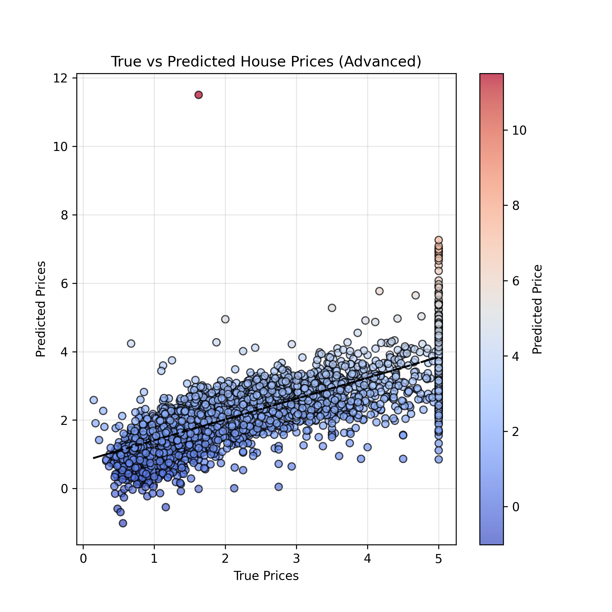
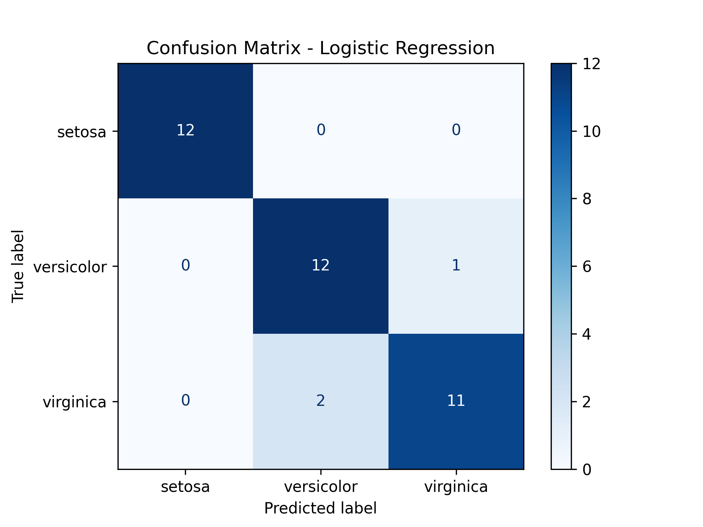
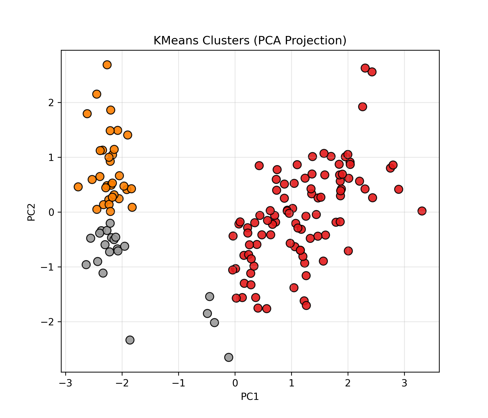

```
# Advanced Programming - Assignment 3  
### Machine Learning Regression, Classification, and Clustering Project  
**Author:** Faeze Ahmadi  
**Course:** Advanced Programming (Python)  
**Instructor:** *Dr. Mahmoud Shirazi, IASBS*

---

## Overview

This project implements **three major Machine Learning tasks** using Python and scikit-learn:

1. **Regression** (predicting continuous values)  
2. **Classification** (predicting discrete categories)  
3. **Clustering** (unsupervised grouping)

The project is developed in **two levels for each part**:

- A **simple version** (intro-style, minimal code)  
- An **advanced version** (OOP-based, structured, with logging, error handling, PCA visualization, model saving, and professional plotting)

This repository is designed to be clean, educational, and easy to follow — even for students encountering these ML topics for the first time.

---

## Project Structure

```

advanced-programming-assignment-3/
│
├── part1_regression/
│   ├── regression.py                      # Simple version
│   ├── regression_advanced.py             # Advanced OOP version
│   ├── regression_plot.png                # Basic visualization
│   ├── regression_advanced_plot.png       # Advanced visualization
│   └── regression_model.pkl               # Saved ML model
│
├── part2_logistic_regression/
│   ├── classification.py                  # Simple version
│   ├── classification_advanced.py         # Advanced OOP + PCA
│   ├── predicted_classes.png              # Basic visualization
│   ├── confusion_matrix.png
│   ├── predicted_pca.png                  # PCA visualization
│   ├── real_pca.png
│   ├── confusion_matrix_advanced.png      # Styled CM
│   └── iris_model.pkl                     # Saved model
│
├── part3_clustering/
│   ├── clustering.py                      # Simple version
│   ├── clustering_advanced.py             # Advanced version
│   ├── clusters.png                       # Simple visualization
│   ├── elbow_method.png                   # Elbow method
│   ├── clusters_pca.png                   # PCA clustering view
│   ├── real_labels_pca.png                # PCA real classes
│   └── kmeans_model.pkl                   # Saved model
│
├── requirements.txt
└── README.md

```

---

# Installation & Setup

### 1. Clone the repository

```bash
git clone https://github.com/Faeze-Ahmadi/advanced-programming-assignment-3 
cd advanced-programming-assignment-3
````

### 2. Create and activate a virtual environment

```bash
python -m venv venv
source venv/bin/activate     # Mac/Linux
venv\Scripts\activate        # Windows
```

### 3. Install dependencies

```bash
pip install -r requirements.txt
```

---

# Part 1 — Regression (California Housing)

### ✔ Goal

Predict house prices using the **California Housing Dataset**.

### ✔ Techniques used

* Linear Regression
* Train/test split
* Evaluation (R² Score)
* Visualization (True vs Predicted prices)
* OOP implementation (advanced version)
* Model saving (`.pkl`)
* Error handling + logging

### ✔ How to run

**Simple version:**

```bash
python part1_regression/regression.py
```

**Advanced version:**

```bash
python part1_regression/regression_advanced.py
```

### Output example

* `regression_plot.png`
* `regression_advanced_plot.png`
* `regression_model.pkl`

---

# Part 2 — Classification (Iris Dataset)

### ✔ Goal

Predict the class of Iris flowers using Logistic Regression.

### ✔ Techniques used

* Logistic Regression
* Confusion Matrix
* Data visualization (Styled scatter plots)
* PCA (Principal Component Analysis)
* Model saving
* Error handling + logging
* OOP structure (advanced version)

### ✔ How to run

**Simple version:**

```bash
python part2_logistic_regression/classification.py
```

**Advanced version:**

```bash
python part2_logistic_regression/classification_advanced.py
```

### Output example

* `predicted_classes.png`
* `predicted_pca.png`
* `real_pca.png`
* `confusion_matrix.png`
* `confusion_matrix_advanced.png`
* `iris_model.pkl`

---

# Part 3 — Clustering (Iris Dataset with KMeans)

### Goal

Cluster Iris data using **KMeans**, then compare the clusters to real labels.

### Techniques used

* KMeans clustering
* PCA visualization
* Silhouette score
* Elbow method
* Model saving
* Error handling + logging
* Full OOP architecture (advanced version)

### How to run

**Simple version:**

```bash
python part3_clustering/clustering.py
```

**Advanced version:**

```bash
python part3_clustering/clustering_advanced.py
```

### ✔ Output example

* `clusters.png`
* `clusters_pca.png`
* `real_labels_pca.png`
* `elbow_method.png`
* `kmeans_model.pkl`

---

# Visualization Highlights

This project comes with **fully-styled plots**, including:

* Coolwarm & Viridis color maps
* PCA-transformed visualizations
* Clean grids
* High-DPI (300) saved images
* Confusion matrix with labels
* Elbow method curve
* Silhouette score calculation

You can find all plots inside their respective folders.

---

# Saved Models

Each advanced module saves its trained model as a `.pkl` file:

* Linear Regression → `regression_model.pkl`
* Logistic Regression → `iris_model.pkl`
* KMeans Clustering → `kmeans_model.pkl`

These can later be reused without retraining.

---

# What You Learn From This Project

By reading and running this project, you learn:

* How ML datasets are prepared
* Difference between regression, classification, clustering
* How ML models are trained and evaluated
* How PCA helps visualize high-dimensional data
* How to write clean, modular, and object-oriented ML code
* How to log, handle errors, and save models
* How to structure a professional ML project

This repository is suitable for:

* Students
* Beginners in ML
* Anyone learning Python + scikit-learn
* People preparing ML assignments
* Data science portfolio building

---

---

## Sample Output Visualizations

Below are three example visualizations generated by the advanced versions of the project:

### 1. Regression – True vs Predicted House Prices


### 2. Classification – Confusion Matrix (Advanced)


### 3. Clustering – KMeans Clusters in PCA Space


---

# Final Notes

This project combines **clean coding**, **machine learning skills**, **modern visualization**, and **OOP design** into a fully functional assignment.

If you want to improve it further, some ideas include:

* Adding hyperparameter tuning
* Using more advanced classifiers (SVM, RandomForest)
* Adding Jupyter notebooks
* Adding model evaluation reports in HTML/PDF

---

# Contact

If you have questions, feel free to contact me!
Happy Learning.

```
